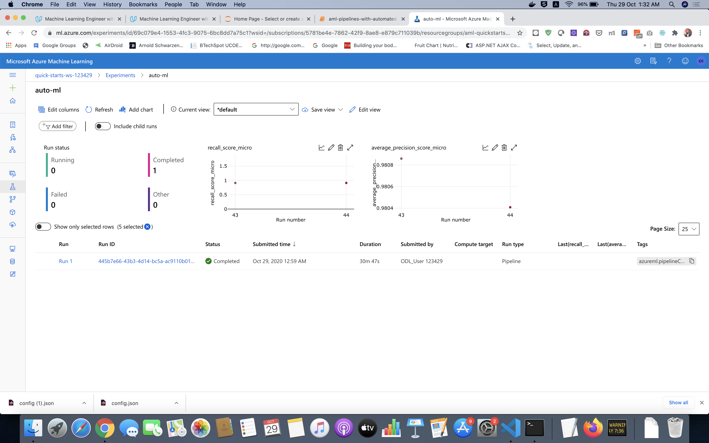
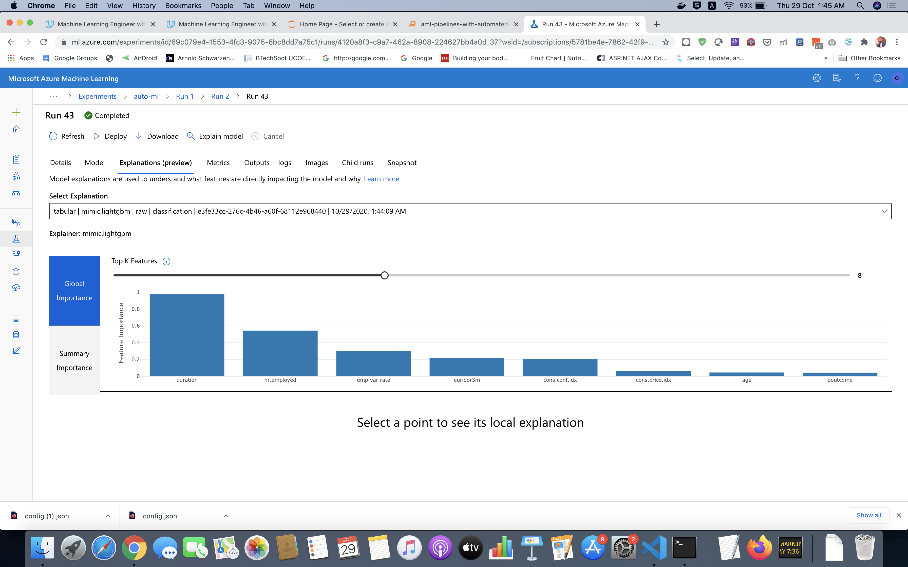

Operationalizing Machine Learning Project:

This project was all about deploying ML models using Azure Platform. We learnt to deploy, authenticate, create and check logs, and use the deployed model as the REST API.

## Architectural Diagram

Ways to improve:
1. Traini AutoML for longer duration to test out more models
2. Provide a good and custom cross validation strategy.

## Screen Recording
Kindly check the screen recording on [Youtube](https://www.youtube.com/watch?v=33qlU9rH50s)

## Key Steps

1. Dataset upload
The dataset on which we want to run AutoML is loaded in Azure ML studio.

2. Experiment completed using Auto ML

Auto ML finds the best model as Voting Ensemble with AUC around 94%.

3. Deployment of Best Model

In Azure, when we use ACI for deployment , we get a unique REST endpoint, SWAGGER URI and key. REST endpoint and key are used for authentication.

4. Enable Logging

Logging enables us to find and debug errors.

5. Consume Model Endpoints

Swagger helps us identify and understand request and response parameters. It specifies GET and POST methods of REST API in our case.

We get a json response using REST URI and key for authentication.

6. Create and publish pipeline

In this step we use Azure ML Python SDK to create and publish a pipeline endpoint.

